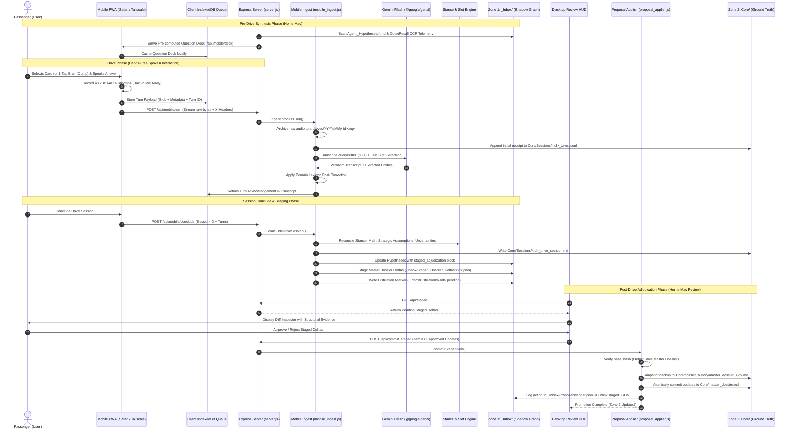

# Madrone Context: Technical Architecture Overview (v2.0.0)

Madrone Context is a local-first, privacy-preserving cognitive elicitation and context governance platform. It solves "context starvation" for autonomous AI agent networks by capturing human strategic intent, tacit constraints, emotional friction, and priority trade-offs. The system bridges asynchronous desktop synthesis with low-cognitive-load, hands-free spoken capture during passenger travel ("Madrone Drive") and synchronizes verified knowledge into Obsidian markdown vaults.

---

## 1. System Architecture Diagram

```mermaid
graph TB
    subgraph ClientLayer ["Client Layer"]
        subgraph MobilePWA ["Mobile Safari PWA (iOS / iPadOS)"]
            PWA_UI["Distraction-Free Glanceable HUD<br/>(Large-Type Typography, Night Cabin Palette)"]
            PWA_Audio["MediaRecorder API<br/>(48 kHz AAC audio/mp4)"]
            PWA_Store["IndexedDB Atomic Store<br/>(Offline Turn Queue & Idempotency Cache)"]
            PWA_SW["Service Worker<br/>(App Shell & Card Deck Prefetching)"]
        end

        subgraph DesktopRenderer ["Desktop Electron Renderer (macOS)"]
            Desk_UI["Desk Review & Live Session HUD<br/>(Context Browser, Card Reviewer, Diff Inspector)"]
            Desk_Bridge["Renderer Bridge (preload.js)<br/>(contextIsolation: true, sandbox: true)"]
        end
    end

    subgraph HostLayer ["Local Host Orchestrator (Electron Main & Embedded Servers)"]
        IPC_Main["Electron Main Process (main.js)<br/>(IPC Handlers, App Lifecycle, Dialogs)"]
        Sec_Store["macOS Keychain (safeStorage)<br/>1Password CLI & Key Resolution"]
        
        subgraph ServerRuntime ["Node.js Server Runtime (src/server.js)"]
            Exp_Server["Express 5 HTTP Server<br/>(REST API, Static Hosting: /static, /mobile)"]
            WS_Orchestrator["WebSocket /ws/orchestrator<br/>(Real-Time Audio & State Machine)"]
            WS_Archive["WebSocket /ws/archive<br/>(Desktop Binary WebM Stream)"]
        end

        subgraph CoreSubsystems ["Core Processing Subsystems"]
            DeckBuilder["src/deck_builder.js<br/>(Hypothesis & Surprise Aggregator)"]
            MobileIngest["src/mobile_ingest.js<br/>(Atomic Turn Ingestion & Staging)"]
            PropApplier["src/proposal_applier.js<br/>(Gate Matrix & Reversibility Engine)"]
            StorageMgr["src/storage.js<br/>(Vault Paths & Dossier History Snapshots)"]
            ForkDetector["src/fork_detector.js<br/>(Telemetry & Git/OpenRecall Anomaly Detector)"]
        end
    end

    subgraph ExternalServices ["External Services & AI Providers"]
        GeminiAPI["Google Gemini (@google/genai)<br/>(gemini-flash-latest: STT & Fast Turn Synthesis)"]
        ClaudeAPI["Anthropic Claude (@anthropic-ai/sdk)<br/>(Claude Fable 5.1 / Sonnet: Deep Deck Synthesis)"]
        OpenAIAPI["OpenAI API (@openai)<br/>(GPT-4o: Hybrid Verification)"]
        TailscaleNet["Tailscale Secure Mesh<br/>(Encrypted HTTPS Proxy to Mobile Client)"]
        GoogleOAuth["Google Cloud Identity<br/>(OAuth Loopback & Gmail/Calendar Context)"]
        OpenRecallDB["OpenRecall SQLite (db.sqlite)<br/>(Screen OCR High-Water Mark Telemetry)"]
    end

    subgraph StorageLayer ["Local Storage & Knowledge Base"]
        subgraph ThreeZoneVault ["Obsidian 3-Zone Vault Governance"]
            Zone1["Zone 1: _Inbox/ (Shadow Graph)<br/>Agent_Hypotheses/, Staged_Dossier_Deltas/, Proposals/"]
            Zone2["Zone 2: Core/ (Ground Truth)<br/>master_dossier.md, Sessions/, Projects/, People/"]
            Zone3["Zone 3: _System/ (Directives & Skills)<br/>Prompts/, Personas/, Operational Specs"]
        end
        MediaArchive["Local Media Store<br/>archives/YYYY/MM/<id>.(mp4|webm)"]
    end

    %% Client Layer to Host
    PWA_UI --> PWA_Audio
    PWA_Audio --> PWA_Store
    PWA_Store -->|HTTPS /api/mobile/turn| Exp_Server
    PWA_SW <-->|Tailscale HTTPS Mesh| Exp_Server
    Desk_UI <--> Desk_Bridge
    Desk_Bridge <-->|ipcRenderer.invoke / send| IPC_Main

    %% Host internal
    IPC_Main --> Sec_Store
    IPC_Main <--> ServerRuntime
    Exp_Server --> MobileIngest
    Exp_Server --> DeckBuilder
    Exp_Server --> PropApplier
    WS_Orchestrator --> CoreSubsystems
    WS_Archive --> MediaArchive

    %% External Connections
    MobileIngest --> GeminiAPI
    DeckBuilder --> ClaudeAPI
    ServerRuntime <--> TailscaleNet
    IPC_Main <--> GoogleOAuth
    ForkDetector <--> OpenRecallDB

    %% Subsystems to Storage
    DeckBuilder <--> Zone1
    MobileIngest --> Zone1
    MobileIngest --> Zone2
    MobileIngest --> MediaArchive
    PropApplier -->|Human Gate Promotion| Zone2
    PropApplier --> Zone1
    StorageMgr <--> ThreeZoneVault
```



---

## 2. In-Drive Interview & Adjudication Data Flow



---

## 3. System Schemas & Data Contracts

All data structures in Madrone Context adhere to strict, parseable contracts to maintain structural integrity across machine boundaries and guarantee deterministic LLM evaluation.

### 3.1 Frontmatter Provenance Schema (`schema: core.project/v1`)
Mandatory schema governing any markdown document promoted to or managed within Zone 2 (`Core/`). Used by downstream agent tooling to establish chain-of-custody.

```yaml
---
schema: core.project/v1
status: verified                     # enum: [draft, candidate, verified, deprecated, archived]
confidence: 0.95                     # float: [0.0 - 1.0]
sources:                             # array of string URIs or identifiers
  - "openrecall:2026-09-26T14:00"
  - "session:2026-09-26_1902"
  - "git:madrone-context@42462ac"
created_by: madrone-drive            # string: agent, process, or persona identifier
verified_by: john                    # string: human adjudicator or verified gatekeeper
verified_at: "2026-10-01T15:45:00Z"  # ISO8601 UTC timestamp
---
```

**JSON Schema Representation:**
```json
{
  "$schema": "https://json-schema.org/draft/2020-12/schema",
  "title": "FrontmatterProvenance",
  "type": "object",
  "required": ["schema", "status", "confidence", "sources", "created_by", "verified_by", "verified_at"],
  "properties": {
    "schema": { "type": "string", "const": "core.project/v1" },
    "status": { "type": "string", "enum": ["draft", "candidate", "verified", "deprecated", "archived"] },
    "confidence": { "type": "number", "minimum": 0.0, "maximum": 1.0 },
    "sources": { "type": "array", "items": { "type": "string" }, "minItems": 1 },
    "created_by": { "type": "string" },
    "verified_by": { "type": "string" },
    "verified_at": { "type": "string", "format": "date-time" }
  }
}
```

---

### 3.2 Hypothesis Card Frontmatter Schema (`_Inbox/Agent_Hypotheses/*.md`)
Governs cards staged in Zone 1 for passenger adjudication. Cards are synthesized by background agents, prioritized into strategic tiers, presented in the mobile HUD, and mutated upon adjudication.

```yaml
---
id: tier1-01-kill-list
badge: "STRATEGY: KILL LIST"
reservoir: antigravity
source: Portfolio Rationalization
question: "Of e-foil, Smart Bowl, Lego Studio, PAX AI, Friend Shares, and Karting upgrades — which two are officially frozen for 12 months as of today?"
context: Forced resource allocation and cognitive de-cluttering across active projects.
priority: 100                        # integer: 1-100 (higher = prioritized earlier in deck)
tags:
  - strategy
  - focus
  - kill-list
kind: hypothesis                     # enum: [hypothesis, contradiction_probe, recurring]
status: open                         # enum: [open, staged, resolved, retired, superseded]
answer_status: unasked               # enum: [unasked, asked, answered, skipped]
created: "2026-09-26"                # YYYY-MM-DD
presupposition_check:
  presupposes: []
  verified_by: []
  unverified: []
open_ranges: []
entities: []
ask_count: 0
schema_version: 1

# Appended dynamically by src/mobile_ingest.js upon completion of spoken turn:
staged_adjudication:
  status: "resolved"                 # enum: [resolved, partial, contradiction, open]
  verdict: "resolved"
  stance: "decided"                  # enum: [decided, tentative, rejected, deferred]
  summary: "Officially froze e-foil and Lego Studio for 12 months..."
  session_id: "2026-10-03_1420"
  missing_slots: []
  assumptions_flagged: ["tax-residency-ca"]
  human_reviewed: false
---
```

---

### 3.3 Session Note Frontmatter Schema (`Core/Sessions/*.md`)
Applied to durable session logs recorded during live desktop interviews or mobile drive sessions.

#### Desktop Session Note Frontmatter (`<sessionId>_session.md`):
```yaml
---
session_id: 2026-09-28_1530
date: 2026-09-28                     # YYYY-MM-DD
time: "15:30"                        # HH:MM
duration: "18:45"                    # MM:SS
duration_min: 19                     # integer
model: gemini-flash-latest
persona: socratic
type: interview                      # enum: [interview, deep-dive, inbox-review]
people:
  - "[[Sarah Jenkins]]"
projects:
  - "[[Madrone Context]]"
topics:
  - "[[Tailscale Networking]]"
energy: "high"                       # enum: [high, moderate, low, drained]
confidence: 0.92                     # float: 0.0 - 1.0
incongruence: false                  # boolean: true if verbal/behavioral discrepancy detected
recording: archives/2026/09/2026-09-28_1530_audio.mp4
recording_kind: audio                # enum: [audio, video, none]
video_analysis: unavailable          # enum: [done, failed, unavailable]
tags:
  - madrone-session
---
```

#### Mobile Drive Session Note Frontmatter (`<sessionId>_drive_session.md`):
```yaml
---
session_id: "mobile-2026-10-03-1420"
type: "session"
date: "2026-10-03T14:45:00.000Z"
verified_by: "staged_for_review"
total_turns: 8
---
```

---

### 3.4 Staged Proposal Delta Schema (`_Inbox/Staged_Dossier_Deltas/*.json`)
Staged JSON diff proposals generated by `src/mobile_ingest.js` or `src/proposal_applier.js`. These represent candidate mutations to the Master Dossier awaiting human gate adjudication.

```json
{
  "proposal_id": "prop_1727976000_a8f9",
  "proposal_type": "core_fact",
  "target": "Core/master_dossier.md",
  "base_hash": "e3b0c44298fc1c149afbf4c8996fb92427ae41e4649b934ca495991b7852b855",
  "payload": {
    "section": "Active Commitments & Strategy",
    "operation": "append_bullet",
    "diff": "Froze e-foil and Lego Studio capital expenditure for 12 months as of October 2026."
  },
  "evidence": [
    "mobile-session_turn_0",
    "mobile-session_turn_1"
  ],
  "confidence": 0.94,
  "rationale": "Direct, unambiguous verbal declaration on card tier1-01-kill-list.",
  "human_reviewed": false
}
```

**JSON Schema Representation:**
```json
{
  "$schema": "https://json-schema.org/draft/2020-12/schema",
  "title": "StagedProposalDelta",
  "type": "object",
  "required": ["proposal_id", "proposal_type", "target", "payload", "evidence", "confidence", "rationale", "human_reviewed"],
  "properties": {
    "proposal_id": { "type": "string" },
    "proposal_type": { "type": "string", "enum": ["core_fact", "retire_card", "supersede_card", "close_card", "narrow_range", "contradiction"] },
    "target": { "type": "string" },
    "base_hash": { "type": ["string", "null"] },
    "payload": { "type": ["object", "string"] },
    "evidence": { "type": "array", "items": { "type": "string" } },
    "confidence": { "type": "number", "minimum": 0.0, "maximum": 1.0 },
    "rationale": { "type": "string" },
    "human_reviewed": { "type": "boolean" }
  }
}
```

---

### 3.5 Dismissed Feedback Schema (`_Inbox/Dismissed_Feedback.jsonl`)
Append-only JSON Lines ledger recording passenger card dismissals. Read by `src/deck_builder.js` to ensure dismissed cards never resurface.

```json
{"card_id":"tier1-04-ventana-hold-sell","dismissed_at":"2026-10-03T14:32:10.123Z","reason":"irrelevant"}
{"card_id":"tier2-09-agent-blast-radius","dismissed_at":"2026-10-03T14:35:45.456Z","reason":"already_decided"}
```

---

### 3.6 Proposals Ledger Schema (`_Inbox/Proposals/ledger.jsonl`)
Maintained by `src/proposal_applier.js`. Provides an immutable audit trail of every automated and manual promotion, state transition, and reversibility diff.

```json
{
  "proposal_id": "prop_close_tier1-01",
  "type": "close_card",
  "target": "tier1-01-kill-list",
  "by": "auto",
  "confidence": 0.95,
  "rationale": "High-confidence structural evidence match with answered turn.",
  "before": { "status": "open", "answer_status": "unasked", "ask_count": 0 },
  "after": { "status": "resolved", "answer_status": "answered", "ask_count": 1 },
  "timestamp": "2026-10-03T14:46:12.789Z"
}
```

---

## 4. Electron IPC Channel Mapping Table

The Electron main process (`main.js`) communicates with the renderer bridge (`preload.js`) via 44 dedicated channels. All renderer invocations are mediated through `contextBridge.exposeInMainWorld('electronAPI', ...)` with `contextIsolation: true` and `sandbox: true`.

| # | Channel Name | IPC Mechanism | Arguments Signature | Return Type | Handler Description & Security Guarantees |
|---|---|---|---|---|---|
| 1 | `get-status` | `ipcMain.handle` | `()` | `Promise<StatusPayload>` | Returns complete application status: encryption health, paths, contexts, inboxes, keys, and media permissions. |
| 2 | `set-secret` | `ipcMain.handle` | `(name: string, value: string)` | `Promise<StatusPayload>` | Encrypts API keys via `safeStorage` (macOS Keychain) or resolves 1Password `op://` URI references. |
| 3 | `set-setting` | `ipcMain.handle` | `(name: string, value: any)` | `Promise<StatusPayload>` | Whitelist-validated setting updater (`silenceSeconds`, `sessionMinutesSoftLimit`, `anthropicAuth`, `inboxMoveProcessed`, `distillerModel`). |
| 4 | `show-workspace` | `ipcMain.handle` | `()` | `Promise<void>` | Reveals active workspace root folder in macOS Finder via `shell.openPath`. |
| 5 | `add-context` | `ipcMain.handle` | `()` | `Promise<StatusPayload>` | Opens native directory picker dialog to mount an additional Obsidian vault or subfolder context. |
| 6 | `rename-context` | `ipcMain.handle` | `(id: string, name: string)` | `Promise<StatusPayload>` | Updates user-facing label for a configured context. |
| 7 | `remove-context` | `ipcMain.handle` | `(id: string)` | `Promise<StatusPayload>` | Unmounts a context configuration without deleting its underlying files on disk. |
| 8 | `set-active-context` | `ipcMain.handle` | `(id: string)` | `Promise<StatusPayload>` | Sets active target context for subsequent sessions and deck generation. |
| 9 | `change-context-folder` | `ipcMain.handle` | `(id: string)` | `Promise<StatusPayload>` | Directory picker dialog to relocate notes folder for context `id`. |
| 10 | `set-context-media-dir` | `ipcMain.handle` | `(id: string)` | `Promise<StatusPayload>` | Directory picker dialog to designate dedicated recording storage for context `id`. |
| 11 | `reset-context-media-dir` | `ipcMain.handle` | `(id: string)` | `Promise<StatusPayload>` | Resets media directory for context `id` to default (`archives/` inside context notes dir). |
| 12 | `show-context` | `ipcMain.handle` | `(id: string)` | `Promise<void>` | Reveals notes folder for context `id` in macOS Finder via `shell.openPath`. |
| 13 | `set-context-google-accounts` | `ipcMain.handle` | `(id: string, accountIds: string[])` | `Promise<StatusPayload>` | Associates authorized Google accounts with context `id` for scoped calendar/email distillation. |
| 14 | `add-inbox` | `ipcMain.handle` | `(presetDir?: string)` | `Promise<StatusPayload>` | Directory picker dialog (or preset) mounting a mobile capture inbox (e.g., Apple Voice Memos folder). |
| 15 | `remove-inbox` | `ipcMain.handle` | `(id: string)` | `Promise<StatusPayload>` | Removes configured phone-capture inbox directory from background monitoring. |
| 16 | `show-path` | `ipcMain.handle` | `(target: string)` | `Promise<void>` | Safely reveals existing file or folder in Finder via `shell.showItemInFolder(target)`. |
| 17 | `open-in-obsidian` | `ipcMain.handle` | `(target: string)` | `Promise<boolean>` | Resolves vault root and opens markdown note via native `obsidian://open?path=...` deep-link protocol. |
| 18 | `select-openrecall` | `ipcMain.handle` | `()` | `Promise<StatusPayload>` | Native file picker dialog to locate OpenRecall SQLite database (`db.sqlite`). |
| 19 | `clear-openrecall` | `ipcMain.handle` | `()` | `Promise<StatusPayload>` | Unbinds OpenRecall database path from configuration. |
| 20 | `select-google-client` | `ipcMain.handle` | `()` | `Promise<StatusPayload>` | File picker dialog for Google OAuth client secret JSON; parses and validates structure. |
| 21 | `google-connect` | `ipcMain.handle` | `()` | `Promise<{ account, status }>` | Launches local loopback HTTP server and opens browser for Google OAuth2 token authorization flow. |
| 22 | `google-disconnect` | `ipcMain.handle` | `(id: string)` | `Promise<StatusPayload>` | Revokes and deletes stored Google OAuth tokens for account `id`. |
| 23 | `request-media` | `ipcMain.handle` | `()` | `Promise<MediaStatus>` | Requests macOS system microphone and camera entitlements via `systemPreferences.askForMediaAccess`. |
| 24 | `request-microphone` | `ipcMain.handle` | `()` | `Promise<MediaStatus>` | Requests macOS microphone entitlement specifically. |
| 25 | `request-camera` | `ipcMain.handle` | `()` | `Promise<MediaStatus>` | Requests macOS camera entitlement specifically. |
| 26 | `detect-keys` | `ipcMain.handle` | `()` | `Promise<DetectedKey[]>` | Scans local environment variables, `~/.config/anthropic`, and `.env` files for masked API key candidates. |
| 27 | `use-detected-key` | `ipcMain.handle` | `(id: string)` | `Promise<StatusPayload>` | Resolves detected key fingerprint and commits secret to Keychain without exposing raw plaintext to renderer. |
| 28 | `use-anthropic-profile` | `ipcMain.handle` | `()` | `Promise<StatusPayload>` | Binds Anthropic SDK calls to local CLI sign-in profile (`ant auth login`). |
| 29 | `onepassword-list` | `ipcMain.handle` | `(vendor: string)` | `Promise<OpCandidate[]>` | Queries local 1Password CLI (`op item list`) for candidate API key items matching vendor. |
| 30 | `onepassword-import` | `ipcMain.handle` | `(vendor: string, itemId: string)` | `Promise<StatusPayload>` | Reads credential from 1Password item, validates format, and saves into encrypted config. |
| 31 | `onepassword-refresh` | `ipcMain.handle` | `(vendor: string)` | `Promise<StatusPayload>` | Re-reads active key from 1Password reference to pull rotated credentials. |
| 32 | `import-env-file` | `ipcMain.handle` | `()` | `Promise<EnvFileFound>` | Native file picker dialog for external `.env` file; extracts candidate API keys. |
| 33 | `clipboard-key` | `ipcMain.handle` | `(vendor: string)` | `Promise<DetectedKey \| null>` | Reads clipboard only on explicit click; registers key candidate if string matches vendor entropy pattern. |
| 34 | `dismiss-google-suggestion` | `ipcMain.handle` | `()` | `Promise<StatusPayload>` | Dismisses proactive banner prompting Google Workspace integration. |
| 35 | `forget-everything` | `ipcMain.handle` | `()` | `Promise<void>` | Destructive wipe: deletes all stored secrets, context definitions, and resets app to wizard. |
| 36 | `open-privacy-settings` | `ipcMain.handle` | `(kind: string)` | `Promise<void>` | Launches macOS System Settings pane directly to Microphone or Camera privacy permissions. |
| 37 | `open-external` | `ipcMain.handle` | `(url: string)` | `Promise<void>` | Validates `https://` protocol prefix and delegates to default desktop browser via `shell.openExternal`. |
| 38 | `complete-wizard` | `ipcMain.handle` | `()` | `Promise<void>` | Marks onboarding wizard complete and transitions window to main application interface. |
| 39 | `open-app` | `ipcMain.handle` | `()` | `Promise<void>` | Transitions from setup view to main session HUD once essential keys and mic access are confirmed. |
| 40 | `open-settings` | `ipcMain.handle` | `(focus?: string)` | `Promise<void>` | Displays settings window, optionally navigating to focused tab (`wizard`, `settings`, `keys`). |
| 41 | `quit-app` | `ipcMain.on` | `()` | `void` (Fire-and-forget) | Quits Electron runtime immediately via `app.quit()`. |
| 42 | `select-workspace` | `ipcMain.handle` (Legacy) | `()` | `Promise<StatusPayload>` | Directory picker dialog to migrate primary workspace root (superseded by `add-context`). |
| 43 | `select-media-dir` | `ipcMain.handle` (Legacy) | `()` | `Promise<StatusPayload>` | Directory picker dialog to relocate legacy media directory (superseded by `set-context-media-dir`). |
| 44 | `reset-media-dir` | `ipcMain.handle` (Legacy) | `()` | `Promise<StatusPayload>` | Resets global media directory to default `archives/` path (superseded by `reset-context-media-dir`). |

---

## 5. REST and WebSocket Endpoint Mapping Table

The embedded Node.js Express 5 and WebSocket server (`src/server.js`) listens on `127.0.0.1` (dynamic or configured port, default `3456`) and exposes APIs consumed by both desktop renderer and mobile PWA clients over Tailscale.

| Endpoint | Method / Protocol | Auth / Headers | Request Payload | Response Schema | Description & Logic |
|---|---|---|---|---|---|
| `/ws/orchestrator` | WebSocket | Local / Loopback | JSON & Binary Audio Chunks | JSON Event Messages | Bidirectional real-time state machine for desktop interviews (`init`, `audio_meta`, `time_check`, `end_session`, `save_session`, `discard_session`). Dispatches VAD events and live transcription tokens. |
| `/ws/archive` | WebSocket | Local / Loopback | Raw Binary Media Stream | Stream Ack | Incremental binary WebM chunk sink. Writes 3-second slices directly to disk (`archives/YYYY/MM/<id>_video.webm`). |
| `/api/deck` | `GET` | Optional Context Query | None | `Array<Card>` | Canonical endpoint serving pre-computed Question Deck from `src/deck_builder.js`. Incorporates surprise cards from `fork_detector.js` and filters dismissed cards. |
| `/api/mobile/deck` | `GET` | Optional Context Query | None | `Array<Card>` | Mobile alias for `/api/deck`. Served with cache-friendly headers for PWA offline prefetching. |
| `/api/mobile/dismiss` | `POST` | `Content-Type: application/json` | `{"card_id": string, "reason": string}` | `{"ok": true, "logged": object}` | Records user dismissal of irrelevant or repetitive question cards into `_Inbox/Dismissed_Feedback.jsonl`. |
| `/api/mobile/turn` | `POST` | `X-Session-ID`, `X-Card-ID`, `X-Turn-Index`, `X-Turn-ID`, `X-Duration`, `Content-Type: audio/mp4` | Binary Audio Buffer (or JSON `{ audio_base64 }`) | `TurnResult` | Ingests atomic spoken turn. Checks idempotency cache by `turnId`, archives raw audio, appends turn receipt to `turns.jsonl`, invokes Gemini Flash STT, runs domain lexicon correction, and executes slot extraction. |
| `/api/mobile/conclude` | `POST` | `Content-Type: application/json` | `{"session_id": string, "turns": Array<Turn>}` | `ConcludeResult` | Concludes drive session. Reconciles turns with durable disk logs, evaluates math/assumptions/uncertainties, creates `Core/Sessions/<id>_drive_session.md`, updates hypotheses frontmatter, and stages Master Dossier deltas. |
| `/api/staged` | `GET` | Optional Context Query | None | `{"ok": true, "items": Array<StagedItem>}` | Lists pending staged proposals awaiting human confirmation from `_Inbox/Staged_Dossier_Deltas/*.json`. |
| `/api/mobile/staged` | `GET` | Optional Context Query | None | `{"ok": true, "items": Array<StagedItem>}` | Mobile alias for `/api/staged`. |
| `/api/commit_staged` | `POST` | `Content-Type: application/json` | `{"item_id": string, "approved_dossier_updates": string[], "force"?: boolean}` | `CommitResult` | Promotes approved updates into `Core/master_dossier.md`. Enforces `base_hash` check (returns 409 `STALE_BASE` if dossier moved) and unlinks staged proposal file upon success. |
| `/api/mobile/commit_staged` | `POST` | `Content-Type: application/json` | Same as `/api/commit_staged` | `CommitResult` | Mobile alias for `/api/commit_staged`. |
| `/api/models` | `GET` | None | None | `{"models": string[], "personas": object[], "lastModel": string}` | Returns available LLM providers and models configured in Keychain and active persona prompt templates. |
| `/api/inbox` | `GET` | None | None | `{"configured": boolean, "items": InboxItem[]}` | Scans configured mobile phone capture inboxes (Voice Memos, text files) for unreviewed raw capture files. |
| `/api/status` | `GET` | None | None | `StatusResponse` | Returns active workspace directories, context list, Google OAuth status, OpenRecall database connection, and MCP status. |
| `/static/*` | HTTP Static | None | None | HTML, CSS, JS | Serves desktop web frontend assets (`frontend/index.html`, `app.js`). |
| `/mobile/*` | HTTP Static | None | None | HTML, CSS, JS, Manifest | Serves mobile Safari PWA assets (`frontend/mobile/index.html`, `mobile.js`, PWA manifest, service worker). |

---

## 6. Audio & Interview Agent Pipelines

### 6.1 Mobile Audio Ingestion Specifications
1. **Format & Codec**: `audio/mp4` with wideband 48 kHz AAC encoding. Captured directly using the client device's microphone array.
2. **Bluetooth HFP Avoidance**: The mobile client strictly bans Bluetooth Hands-Free Profile (HFP 8–16 kHz narrowband), which degrades speech intelligibility in cabin environments. Built-in device microphone hardware is enforced.
3. **Chunking & Hardware Handshake**:
   - `MediaRecorder.onstart` triggers hardware capture confirmation before the visual recording state activates.
   - Per-turn audio blobs are emitted atomically on `MediaRecorder.onstop`.
   - Fragmented MP4 recovery: `src/mobile_ingest.js` inspects MP4 atoms (`ftyp` and `moof`). If a turn payload arrives without an initial `ftyp` box, cached session initialization headers are prepended to ensure clean decoder playback.

### 6.2 AI Processing & Adjudication Pipeline
1. **Gemini Flash STT Transcription**:
   - Spoken audio buffer is dispatched to `gemini-flash-latest` (falling back to `gemini-2.5-flash`) via the official `@google/genai` SDK using inline buffer transmission (`transcribe(audioBuffer, mimeType)`).
2. **Domain Lexicon Post-Correction**:
   - Output transcript passes through `src/lexicon.js` (`getLexicon().postCorrect(transcript)`).
   - Resolves phonetic ambiguities, misrecognized project names, and domain terminology (e.g., "Madrone", "Tailscale", "OpenRecall", "SPG").
3. **Sensitivity Routing**:
   - `src/sensitivity_router.js` inspects transcribed content for personal health, confidential legal identifiers, or sensitive credentials.
   - Diverts sensitive turns to encrypted vaults or private folders (`getPrivateDir()`).
4. **Stance & Slot Reconciliation**:
   - `src/stance.js` evaluates speaker confidence and position (`decided`, `tentative`, `rejected`, `deferred`).
   - `src/slot_tracker.js` verifies whether the spoken turn satisfied the question card's required slots (`expects`). Identifies missing slots and contradictory statements.
5. **Assumption & Uncertainty Detection**:
   - `src/assumption_engine.js` flags implicit tax, legal, or financial assumptions.
   - `src/reconcile.js` (`reconcileSessionMath`) detects numerical and allocation discrepancies.
   - `src/uncertainty_detector.js` surfaces novel or ambiguous entities directly to the desktop clarification queue (`_Inbox/Clarification_Queue/`).
6. **Proposal Staging**:
   - Resolved cards receive an in-place YAML update with a `staged_adjudication` block.
   - Master Dossier updates are structured into `_Inbox/Staged_Dossier_Deltas/<deltaId>.json` alongside the current dossier's SHA256 `base_hash`.

---

## 7. State Persistence & Storage Governance Models

### 7.1 3-Zone Obsidian Vault Architecture
To prevent ungrounded AI hallucinations from contaminating verified strategic truth, the vault is partitioned into three governance zones:

| Zone | Folder | Read/Write Permissions | Purpose & Contents |
|---|---|---|---|
| **Zone 1: Shadow Graph** | `_Inbox/` | Background agents & processors: Read/Write.<br/>Adjudicator: Read/Clear. | Ephemeral drafts, pre-computed Question Decks (`Agent_Hypotheses/`), raw voice dumps (`Raw_Dumps/`), pending proposals (`Staged_Dossier_Deltas/`), dismissed feedback (`Dismissed_Feedback.jsonl`), and audit logs (`Proposals/ledger.jsonl`). |
| **Zone 2: Ground Truth** | `Core/` | **Sole Writer: Madrone Human Gate**.<br/>Agents: Read-Only. | Canonical strategic knowledge base: `master_dossier.md`, dated session transcripts (`Sessions/`), entity nodes (`Projects/`, `People/`, `Topics/`), and immutable pre-rewrite snapshots (`dossier_history/`). |
| **Zone 3: System Directives** | `_System/` | System Admin / Engineering: Read/Write.<br/>Runtime: Read-Only. | Operational constitutions, interviewer personas (`Prompts/`), agent skill definitions (`Skills/`), and schema contracts. |

### 7.2 Human Confirmation Gate & Master Dossier Protection
1. **The Human Gate**: Background agents may write hypotheses and drafts to Zone 1, but **only explicit human adjudication (via desktop review or mobile commitment) can promote facts into Zone 2 (`Core/master_dossier.md`)**.
2. **Stale-Base Detection (`base_hash`)**:
   - Every staged delta records the SHA256 hash of `Core/master_dossier.md` at staging time.
   - When a commit is requested via `commitStagedItem()`, the live hash is recomputed. If the base hash moved, the commit returns HTTP 409 `STALE_BASE` to prevent race conditions and overwrites.
3. **Immutable History Snapshot**:
   - Before applying any updates to `master_dossier.md`, `storage.backupDossier()` creates an immutable snapshot: `Core/dossier_history/master_dossier_<sessionId>.md`.
   - The system validates that updated content retains canonical markdown headers and rejects any output that is empty or suspiciously truncated (<30% of original character length).

### 7.3 Client-Side Offline Resilience & Drain Model
1. **PWA Offline Pre-fetching**: Service Worker caches application shell, stylesheets, icons, and active question deck over Tailscale HTTPS.
2. **Atomic IndexedDB Queue**:
   - Spoken audio turns, recording timestamps, and local turn IDs are written to IndexedDB within an atomic transaction (`transaction.oncomplete`).
   - If cellular connectivity drops during highway travel, turns accumulate safely on the mobile device.
3. **Idempotent Queue Drain**:
   - As Tailscale connectivity is restored, the queue worker replays turns using unique `turnId` headers.
   - `src/server.js` checks its in-memory and disk idempotency cache; duplicate requests return cached results without re-invoking external LLM billing or generating redundant media files.

---

## 8. Failure Modes & Recovery Procedures

| Failure Scenario | Detection Mechanism | System Response & Mitigation | Recovery Action |
|---|---|---|---|
| **API Provider Outage (Gemini / Anthropic)** | `try/catch` in `src/server.js` and `src/mobile_ingest.js`; HTTP 503 / `PROVIDER_UNAVAILABLE`. | Raw audio is safely written to `archives/` and turn record is logged to `turns.jsonl` with `modelUsed: "pending"`. Session is not aborted. | When provider access is restored, desktop orchestrator processes pending audio turns via `distiller.distillIfNeeded()`. |
| **Dropped Mobile Connection Mid-Drive** | Client `fetch()` failure or timeout in PWA worker. | Spoken audio and turn metadata remain durably preserved in client `IndexedDB`. HUD displays offline indicator. | Background drain worker automatically flushes queued turns sequentially once Tailscale connection re-establishes. |
| **Stale Master Dossier Conflict** | `commitStagedItem()` detects `staged.base_hash !== computeDossierHash()`. | Commit is blocked with HTTP 409 `STALE_BASE`. No files in `Core/` are modified. | Reviewer is presented with side-by-side diff between staged proposal and updated dossier; reviewer can re-stage or apply with `force: true`. |
| **Empty or Truncated LLM Dossier Rewrite** | `storage.writeDossier()` length sanity check (<30% length or missing `## ` headings). | Model output is rejected with error. Active `master_dossier.md` is preserved intact. | Error is logged to desktop HUD; prior snapshot remains available in `dossier_history/`. |
| **Corrupted or Truncated Turn in `turns.jsonl`** | Per-line `JSON.parse` check in `concludeDriveSession()`. | Corrupted line is skipped with warning; all valid turns are fully recovered and reconciled. | Session note is assembled from recovered turns and client turn cache. |

---

## 9. Verification & Audit Guide

To independently verify the technical architecture, schema compliance, and IPC/endpoint implementations:

```bash
# 1. Navigate to application root
cd "/Users/honchpersonal/Documents/Anti-gravity/Personal Context/madrone-context"

# 2. Run automated test suite (smoke, mobile ingest, structural remediation)
npm test

# 3. Verify Electron IPC channel registrations
node -e '
  const fs = require("fs");
  const mainCode = fs.readFileSync("main.js", "utf-8");
  const handles = (mainCode.match(/ipcMain\.handle\([^)]+\)/g) || []).length;
  const ons = (mainCode.match(/ipcMain\.on\([^)]+\)/g) || []).length;
  console.log(`ipcMain channels: ${handles} handles, ${ons} ons (total ${handles + ons})`);
'

# 4. Verify Express REST route registrations in src/server.js
node -e '
  const fs = require("fs");
  const serverCode = fs.readFileSync("src/server.js", "utf-8");
  const routes = [...serverCode.matchAll(/app\.(get|post)\(([^,]+)/g)].map(m => `${m[1].toUpperCase()} ${m[2].trim()}`);
  console.log("Registered REST endpoints (" + routes.length + "):\n" + routes.join("\n"));
'
```
